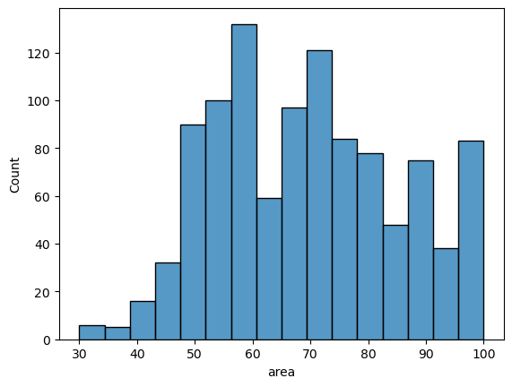
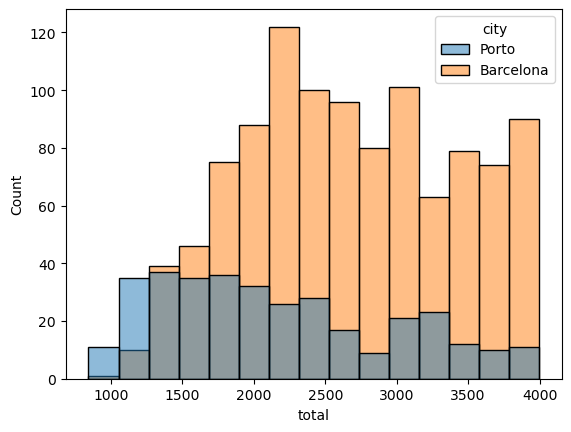
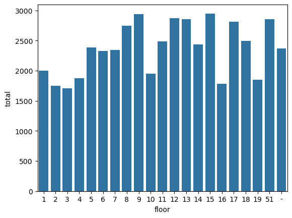

# Data Visualization Project: Property Rental Analysis

This project aims to provide insights into the property rental market by analyzing and visualizing rental data for houses located in cities like Barcelona and Porto. The goal is to identify the best cost-benefit properties for individuals looking to rent, based on specific characteristics such as the number of rooms, parking spaces, rent price, and whether pets are allowed.

## Table of Contents
- Business Questions
- Data Collection and Exploration
- Data Cleaning
- Data Exploration and Visualization
- Insights
- Technologies Used
## Business Questions
### What is my goal?
The goal of this project is to find the best cost-benefit properties for potential renters based on their specific preferences and constraints.

### How can I achieve it?
By selecting properties that align with the user's desired characteristics, such as:

- Location (city)
- Rent price (up to 4000 euros)
- Number of rooms (2 or 3 bedrooms)
- Pet policy (properties that accept pets)
## Data Collection and Exploration
The dataset, houses_rent.xlsx, contains information about various properties, including:

- City
- Area
- Number of Rooms
- Bathrooms
- Parking Spaces
- Floor
- Pet Policy (accepts or not)
- Furniture (furnished or not)
- Monthly Rent Price
- Property Tax
- Fire Insurance
- Total Price
The dataset consists of over 6000 rows and various columns, with relevant information about properties in cities like Barcelona and Porto.

## Data Cleaning
The data was cleaned to remove irrelevant records and to ensure consistency in data types. For example:

- Columns such as rent amount, property tax, fire insurance, and total price were converted to float type.
- Irrelevant entries, such as properties with a total cost greater than 4000 euros or those that do not accept pets, were removed.
## Data Exploration and Visualization
Several important insights were extracted from the cleaned data using descriptive statistics and visualizations:

### Key Metrics:
- Average rent by city
- Average rent by the number of rooms and bathrooms
- Rent distribution by area and city
### Visualizations:
- Average Rent by Number of Rooms and Bathrooms: A bar plot comparing the average rent for properties with different room and bathroom configurations.
- 


- Area Distribution: A histogram showing the distribution of areas for properties with up to 100 m².
   
- Rent Distribution by City: A histplot showing the distribution of rent prices across different cities.
  
- Floor Price Analysis: A bar plot comparing the average rent for properties on different floors.
  
### Insights
- City Comparison: Barcelona has higher average rental prices than Porto, with an average price of around 2683 euros compared to 2162 euros in Porto.

- Room and Bathroom Configuration: Properties with 3 rooms and 2 bathrooms tend to have the highest average rent. Larger properties with more bathrooms, however, are typically more expensive.

- Area vs Rent: Smaller properties (under 100 m²) tend to be more affordable, but the rent increases significantly as the area grows, especially in certain cities like Barcelona.

- Floor vs Rent: Rent prices tend to vary with the floor number. Properties on the 16th floor, for example, tend to have higher rents compared to other floors.

## Technologies Used
- Python: For data cleaning, manipulation, and analysis.
- Pandas: For handling and processing data.
- Matplotlib/Seaborn: For creating visualizations and graphs.
## How to Run the Project
1. Clone the repository.
1. Install required libraries:
```bash 
pip install pandas seaborn matplotlib 
```
3. Run the Jupyter notebook or Python script containing the data analysis and visualization code.
# Conclusion
This project helped a client select the best rental options by leveraging data visualization to understand the property rental market. By filtering data based on key characteristics like rent, number of rooms, and pet policy, the client was able to identify the most suitable rental properties in different cities, making a more informed decision tailored to their specific needs.
